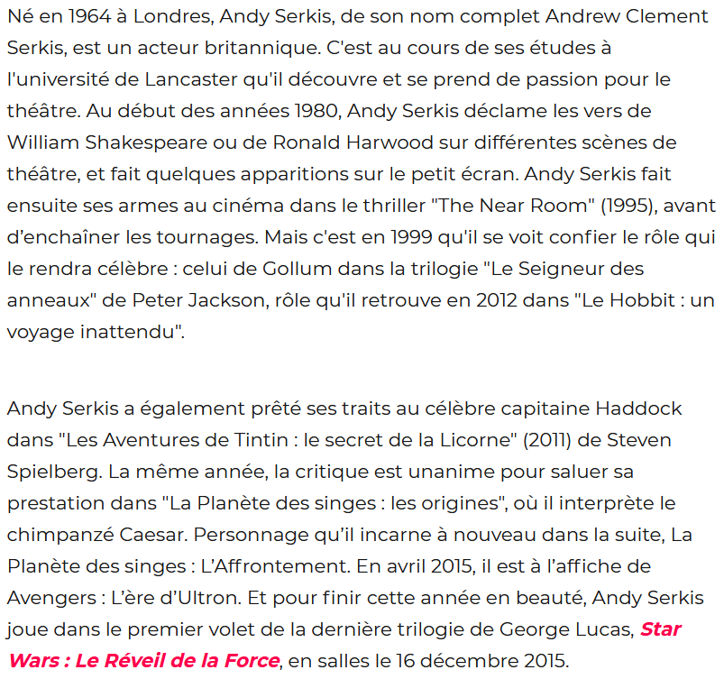

# Andy Serkis : l'égérie de la motion capture

Comme vous avez certainement pu le remarquer, tout au long de ce dossier nous avons beaucoup parlé d'Andy Serkis. C'est, en effet, un acteur qui a beaucoup d'importance dans le domaine de la *motion capture*. Mais *qui* est cet homme aux multiples visages ?

## Qui est Andy Serkis ?

- LA RÉDACTION. « Andy Serkis : biographie courte, dates, citations » [en ligne]. Dans : *L’Internaute*. 6 février 2019. [Consulté le 8 juin 2020]. Disponible à l’adresse : [https://www.linternaute.fr/cinema/biographie/1774578-andy-serkis-biographie-courte-dates-citations/](https://www.linternaute.fr/cinema/biographie/1774578-andy-serkis-biographie-courte-dates-citations/)

- TÉLÉ-LOISIRS. « Andy Serkis : biographie, news, photos et videos » [en ligne]. Dans : Télé-Loisirs [en ligne]. [2019]. [Consulté le 8 juin 2020]. Disponible à l’adresse : [https://www.programme-tv.net/biographie/68877-serkis-andy/](https://www.programme-tv.net/biographie/68877-serkis-andy/)

## Quelle est son importance dans la motion capture ?

- PREMIEREFR. « La Planète des singes : Suprématie - vidéo de la performance capture d'Andy Serkis en César VO » [en ligne]. Dans Google. *Dailymotion* : publié en [2017] [Consulté le 7 juin 2020]. 1 min 1 sec. Disponible à l’adresse : [https://www.dailymotion.com/video/x5sdvnk](https://www.dailymotion.com/video/x5sdvnk)

- IMBERT, Thomas. « Andy Serkis : rencontre avec le roi de la motion capture » [en ligne]. Dans : *AlloCiné*. 16 décembre 2017. [Consulté le 7 juin 2020]. Disponible à l’adresse : [http://www.allocine.fr/article/fichearticle_gen_carticle=18669532.html](http://www.allocine.fr/article/fichearticle_gen_carticle=18669532.html)

- LACROIX, Emilien et LA VALETTE, Phalène de. « « La Planète des singes » - Andy Serkis : « La performance capture est un futur standard du cinéma » » [en ligne]. Dans : *Le Point*. 21 juillet 2014. [Consulté le 8 juin 2020]. Disponible à l’adresse : [https://www.lepoint.fr/cinema/andy-serkis-la-performance-capture-est-un-futur-standard-du-cinema-21-07-2014-1847724_35.php](https://www.lepoint.fr/cinema/andy-serkis-la-performance-capture-est-un-futur-standard-du-cinema-21-07-2014-1847724_35.php)

## Quel est son point de vue sur la motion capture ?

- IMBERT, Thomas. « Andy Serkis : rencontre avec le roi de la motion capture » [en ligne]. Dans Google. *AlloCiné* : publié le 16 décembre 2017. [Consulté le 7 juin 2020]. 5 min 28 sec. Disponible à l’adresse : [http://www.allocine.fr/article/fichearticle_gen_carticle=18669532.html](http://www.allocine.fr/article/fichearticle_gen_carticle=18669532.html)

- BARDINET, Elodie. « L’évolution de la performance capture racontée par Andy Serkis » [en ligne]. Dans : *Premiere.fr*. 6 décembre 2018. [Consulté le 7 juin 2020]. Disponible à l’adresse : [http://www.premiere.fr/Cinema/News-Cinema/L-evolution-de-la-performance-capture-racontee-par-Andy-Serkis](http://www.premiere.fr/Cinema/News-Cinema/L-evolution-de-la-performance-capture-racontee-par-Andy-Serkis)

### *Le Seigneur des Anneaux* : les débuts de la motion capture

### *King Kong* : la naissance de la performance physique

### *Avatar* : une révolution

### *La Planète des singes* : tourné en extérieur

### *Mowgli* : des rôles plus diversifiés

### Prochaine étape avec *Avatar* : filmer sous l’eau

