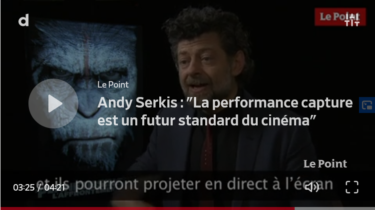

# Andy Serkis : l'égérie de la *Motion Capture*

Comme vous avez certainement pu le remarquer tout au long de ce dossier, Andy Serkis est un acteur qui a beaucoup d'importance dans la *Motion Capture*.

**Mais qui est-il au juste ?**

## Qui est Andy Serkis ?

## Quelle est son importance dans la *Motion Capture* ?

- La Planète des singes : Suprématie - Vidéo de la performance capture d’Andy Serkis en César VO - Vidéo Dailymotion [en ligne]. 2017. [Consulté le 7 juin 2020]. Disponible à l’adresse : [https://www.dailymotion.com/video/x5sdvnk](https://www.dailymotion.com/video/x5sdvnk)

- LACROIX, Emilien et LA VALETTE, Phalène de. « La Planète des singes » - Andy Serkis : « La performance capture est un futur standard du cinéma ». Dans : Le Point [en ligne]. 21 juillet 2014. [Consulté le 8 juin 2020]. Disponible à l’adresse : [https://www.lepoint.fr/cinema/andy-serkis-la-performance-capture-est-un-futur-standard-du-cinema-21-07-2014-1847724_35.php](https://www.lepoint.fr/cinema/andy-serkis-la-performance-capture-est-un-futur-standard-du-cinema-21-07-2014-1847724_35.php)

## Quelle est son point de vue sur la *Motion Capture* ?

- IMBERT, Thomas. Andy Serkis : rencontre avec le roi de la motion capture. Dans : AlloCiné [en ligne]. 16 décembre 2017. [Consulté le 7 juin 2020]. Disponible à l’adresse : [http://www.allocine.fr/article/fichearticle_gen_carticle=18669532.html](http://www.allocine.fr/article/fichearticle_gen_carticle=18669532.html)

- BARDINET, Elodie. L’évolution de la performance capture racontée par Andy Serkis. Dans : Premiere.fr [en ligne]. 6 décembre 2018. [Consulté le 7 juin 2020]. Disponible à l’adresse : [http://www.premiere.fr/Cinema/News-Cinema/L-evolution-de-la-performance-capture-racontee-par-Andy-Serkis](http://www.premiere.fr/Cinema/News-Cinema/L-evolution-de-la-performance-capture-racontee-par-Andy-Serkis)

### *Le Seigneur des Anneaux* : les débuts de la motion capture

### *King Kong* : la naissance de la performance physique

### *Avatar* : une révolution

### *La Planète des singes* : tourné en extérieur

### *Mowgli* : des rôles plus diversifiés

### Prochaine étape avec *Avatar* : filmer sous l’eau

