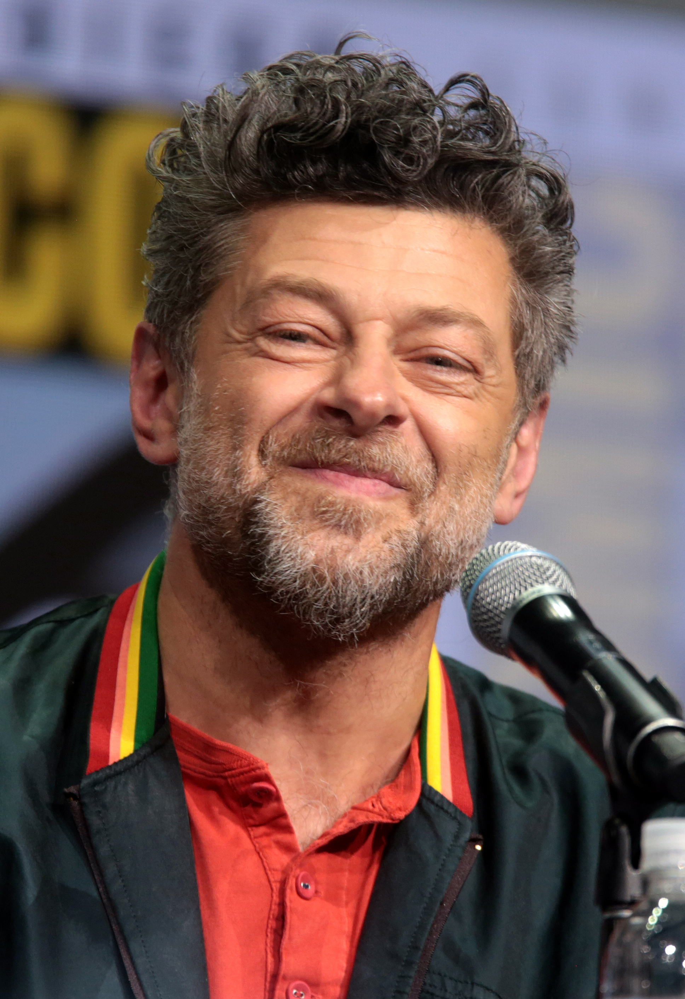

# Andy Serkis : l'égérie de la *Motion Capture*

Comme vous avez certainement pu le remarquer tout au long de ce dossier, Andy Serkis est un acteur qui a beaucoup d'importance dans la *Motion Capture*.

**Mais qui est-il au juste ?**

## Qui est Andy Serkis ?

## Quelle est son importance dans la *Motion Capture* ?

## Quelle est son point de vue sur la *Motion Capture* ?

