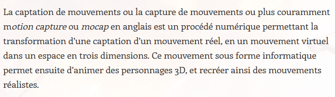

# Définitions

- Définition du groupe KDCB

CABANNES, Léo. « Histoire de la Motion Capture » [en ligne]. Dans : *KDCB - Motion Capture*. 16 janvier 2013. [Consulté le 5 juin 2020]. Disponible à l’adresse : [https://kdcbtpe.wordpress.com/history/](https://kdcbtpe.wordpress.com/history/)

- Définition du GameArt

GAMEART. « Motion capture – Définition » [en ligne]. Dans : *GameArt*. 2020. [Consulté le 5 juin 2020]. Disponible à l’adresse : [http://www.gameart.eu/publi/dossiers/lexique/motion-capture.html](http://www.gameart.eu/publi/dossiers/lexique/motion-capture.html)

- Définition du Larousse

LAROUSSE. « Définitions : motion capture » [en ligne]. Dans : *Dictionnaire de français Larousse*. 2020. [Consulté le 5 juin 2020]. Disponible à l’adresse : [https://www.larousse.fr/dictionnaires/francais/motion_capture/10910885](https://www.larousse.fr/dictionnaires/francais/motion_capture/10910885)

- Définition de l'office québécois de la langue française

OFFICE QUÉBÉCOIS DE LA LANGUE FRANÇAISE. « Capture de mouvement » [en ligne]. Dans : *Office québécois de la langue française*. 2014. [Consulté le 5 juin 2020]. Disponible à l’adresse : [http://gdt.oqlf.gouv.qc.ca/ficheOqlf.aspx?Id_Fiche=8383124](http://gdt.oqlf.gouv.qc.ca/ficheOqlf.aspx?Id_Fiche=8383124)

