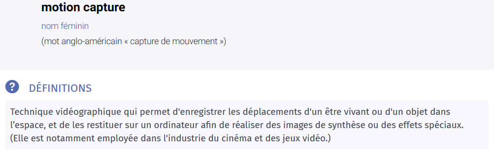
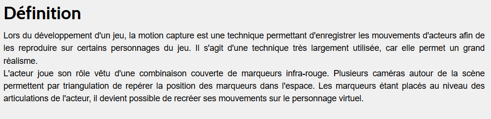
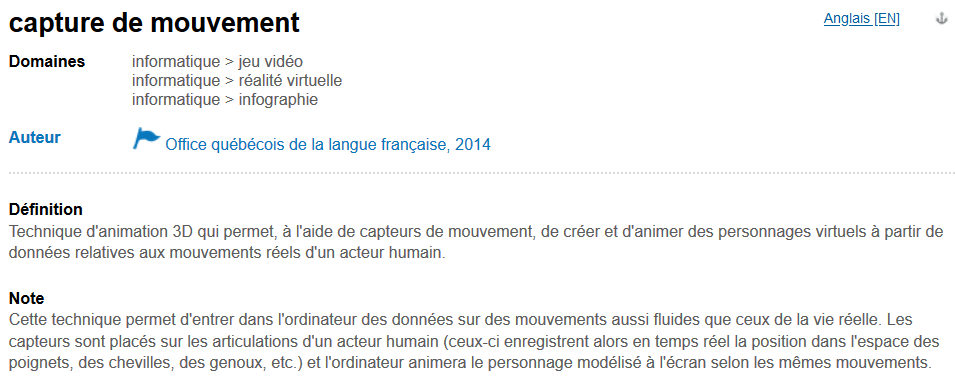

# Définitions

- [Définition du Larousse](https://www.larousse.fr/dictionnaires/francais/motion_capture/10910885)

- [Définition du GameArt](http://www.gameart.eu/publi/dossiers/lexique/motion-capture.html)

- [Définition de l'office québécois de la langue française](http://gdt.oqlf.gouv.qc.ca/ficheOqlf.aspx?Id_Fiche=8383124)

