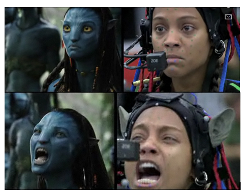
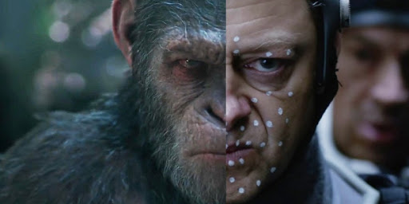

# Quelques exemples de films et jeux vidéos utilisant la Motion Capture

## Films

### Avatar

### La planète des singes

### Alita : Battle Angel

## Jeux vidéos

### [Until down]

## Films d'animation

### Les Aventures de Tintin : Le Secret de La Licorne
