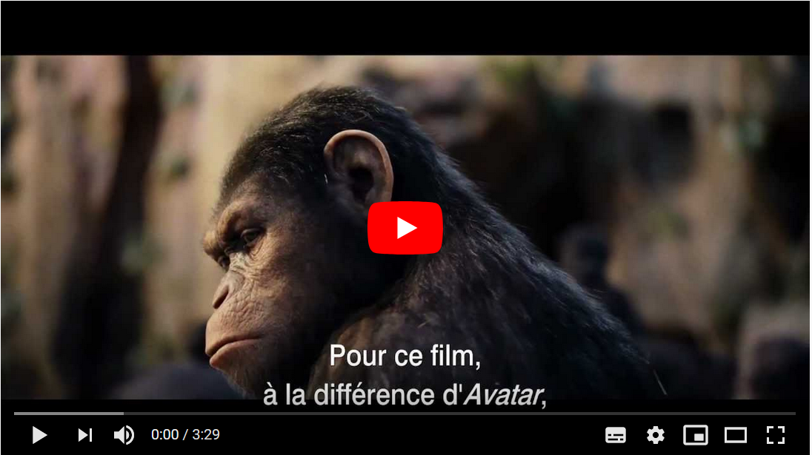

# Quelques exemples de films et jeux vidéo utilisant la Motion Capture

## Films d'animation

### Le Pôle express

- The Polar Express - 10 Behind The Scenes Facts [en ligne]. 14 décembre 2018. [Consulté le 7 juin 2020]. Disponible à l’adresse : [https://www.youtube.com/watch?v=1mN4VAwhrk4](https://www.youtube.com/watch?v=1mN4VAwhrk4)

- IMBERT, Thomas. Le contrôleur du « Pôle Express » (2004): Edouard, Gollum, Chappie... : 16 personnages en motion capture. Dans : AlloCiné [en ligne]. 9 avril 2015. [Consulté le 7 juin 2020]. Disponible à l’adresse : [http://www.allocine.fr/article/fichearticle_gen_carticle=18640324.html?page=7](http://www.allocine.fr/article/fichearticle_gen_carticle=18640324.html?page=7)

### Les Aventures de Tintin : Le Secret de La Licorne

- Making-off «Tintin», Nick Frost and Simon Pegg [en ligne]. 17 décembre 2011. [Consulté le 7 juin 2020]. Disponible à l’adresse : [https://www.youtube.com/watch?v=MfOV25rkHCI](https://www.youtube.com/watch?v=MfOV25rkHCI)

- GATTEGNO, Hervé et COLOMBANI, Florence. « Les aventures de Tintin : le secret de la Licorne » - Tintin passe-t-il l’écran ? Dans : Le Point [en ligne]. 20 octobre 2011. [Consulté le 7 juin 2020]. Disponible à l’adresse : [https://www.lepoint.fr/cinema/les-aventures-de-tintin-le-secret-de-la-licorne-tintin-passe-t-il-l-ecran-20-10-2011-1388982_35.php](https://www.lepoint.fr/cinema/les-aventures-de-tintin-le-secret-de-la-licorne-tintin-passe-t-il-l-ecran-20-10-2011-1388982_35.php)

## Films

### Avatar

- BEHIND THE SCENE - Avatar The Movie (Part 3) [en ligne]. 17 janvier 2010. [Consulté le 7 juin 2020]. Disponible à l’adresse : [https://www.youtube.com/watch?v=ClXxZyf1EnY](https://www.youtube.com/watch?v=ClXxZyf1EnY)

- DELCROIX, Olivier. La révolution «Avatar». Dans : Le Figaro.fr [en ligne]. 31 décembre 2009. [Consulté le 7 juin 2020]. Disponible à l’adresse : [https://www.lefigaro.fr/cinema/2009/12/31/03002-20091231ARTFIG00008-la-revolution-avatar-.php](https://www.lefigaro.fr/cinema/2009/12/31/03002-20091231ARTFIG00008-la-revolution-avatar-.php)

### King Kong

- Bringing Kong to Life Part 1 - Motion Capture.mov [en ligne]. 30 avril 2010. [Consulté le 7 juin 2020]. Disponible à l’adresse : [https://www.youtube.com/watch?v=4iGQvER6Tns&t](https://www.youtube.com/watch?v=4iGQvER6Tns&t)

- IMBERT, Thomas. « King Kong » (2005): Edouard, Gollum, Chappie... : 16 personnages en motion capture. Dans : AlloCiné [en ligne]. 9 avril 2015. [Consulté le 7 juin 2020]. Disponible à l’adresse : [http://www.allocine.fr/article/fichearticle_gen_carticle=18640324.html?page=8](http://www.allocine.fr/article/fichearticle_gen_carticle=18640324.html?page=8)

### Le Hobbit : La désolation de Smaug

- The Hobbit: The Desolation of Smaug | Extended Edition - Smaug MoCap | Warner Bros. Entertainment [en ligne]. 22 octobre 2014. [Consulté le 7 juin 2020]. Disponible à l’adresse : [https://www.youtube.com/watch?v=W4mL-jqs9cE](https://www.youtube.com/watch?v=W4mL-jqs9cE)

- IMBERT, Thomas. Smaug dans « Le Hobbit : la Désolation de Smaug » (2013): Edouard, Gollum, Chappie... : 16 personnages en motion capture. Dans : AlloCiné [en ligne]. 9 avril 2015. [Consulté le 7 juin 2020]. Disponible à l’adresse : [http://www.allocine.fr/article/fichearticle_gen_carticle=18640324.html?page=16](http://www.allocine.fr/article/fichearticle_gen_carticle=18640324.html?page=16)

### La Planète des singes

- La Planète des singes : Les origines - Effets speciaux Weta [en ligne]. 20th Century Studios FR, 29 juillet 2011. [Consulté le 7 juin 2020]. Disponible à l’adresse : [https://www.youtube.com/watch?v=j8WPI3zkxkw](https://www.youtube.com/watch?v=j8WPI3zkxkw)

- TALABOT, Jean. La Planètes de singes, la suprématie des effets spéciaux. Dans : Le Figaro.fr [en ligne]. 11 juillet 2017. [Consulté le 7 juin 2020]. Disponible à l’adresse : [https://www.lefigaro.fr/cinema/2017/07/11/03002-20170711ARTFIG00107--la-planetes-de-singes-la-suprematie-des-effets-speciaux.php](https://www.lefigaro.fr/cinema/2017/07/11/03002-20170711ARTFIG00107--la-planetes-de-singes-la-suprematie-des-effets-speciaux.php)

### Alita : Battle Angel

- ALITA: BATTLE ANGEL | Behind the Scenes with WETA Featurette [en ligne]. 3 février 2019. [Consulté le 7 juin 2020]. Disponible à l’adresse : [https://www.youtube.com/watch?v=ETs8B2axTcw](https://www.youtube.com/watch?v=ETs8B2axTcw)

- LANGLOIS, Caroline. Alita : Battle Angel : dans les coulisses de la performance capture. Dans : AlloCiné [en ligne]. 12 février 2019. [Consulté le 7 juin 2020]. Disponible à l’adresse : [http://www.allocine.fr/article/fichearticle_gen_carticle=18678836.html](http://www.allocine.fr/article/fichearticle_gen_carticle=18678836.html)

## Jeux vidéos

### Until Dawn

- Until DawnTM: From Stage To Screen [en ligne]. 5 septembre 2015. [Consulté le 7 juin 2020]. Disponible à l’adresse : [https://www.youtube.com/watch?v=CEMFbhCf4-o](https://www.youtube.com/watch?v=CEMFbhCf4-o)

- APOLLOMISANDRIE. Until Dawn : une analyse transmédiale. Dans : Simonae [en ligne]. 24 mars 2017. [Consulté le 7 juin 2020]. Disponible à l’adresse : [https://simonae.fr/sciences-culture/jeux-video/until-dawn-analyse-transmediale/](https://simonae.fr/sciences-culture/jeux-video/until-dawn-analyse-transmediale/)

### The Last of Us

- The Last of Us - Car Scene Performance Capture [en ligne]. 6 juillet 2013. [Consulté le 7 juin 2020]. Disponible à l’adresse : [https://www.youtube.com/watch?v=H2fNUeQ6L6s](https://www.youtube.com/watch?v=H2fNUeQ6L6s)

- METREAU, Joel. «The Last of Us»: Un road-trip émouvant dans les ruines de l’humanité. Dans : 20 minutes [en ligne]. 17 juin 2013. [Consulté le 7 juin 2020]. Disponible à l’adresse : [https://www.20minutes.fr/high-tech/1175215-20130617-20130617-the-last-of-us-road-trip-emouvant-ruines-lhumanite](https://www.20minutes.fr/high-tech/1175215-20130617-20130617-the-last-of-us-road-trip-emouvant-ruines-lhumanite)

