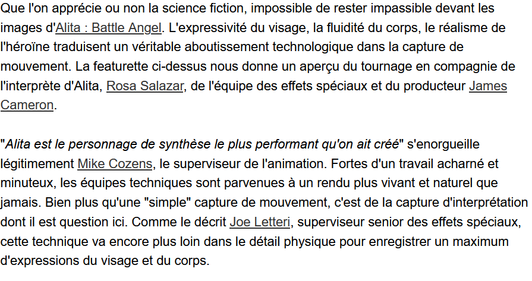

# Quelques exemples de films et jeux vidéos utilisant la Motion Capture

## Films d'animation

### Le Pôle express

- [vidéo](https://www.youtube.com/watch?v=1mN4VAwhrk4)

- [source](http://www.allocine.fr/article/fichearticle_gen_carticle=18640324.html?page=7)

### Les Aventures de Tintin : Le Secret de La Licorne

- [vidéo](https://www.youtube.com!/watch?v=MfOV25rkHCI)

- [source](https://www.lepoint.fr/cinema/les-aventures-de-tintin-le-secret-de-la-licorne-tintin-passe-t-il-l-ecran-20-10-2011-1388982_35.php)

## Films

### Avatar

- [vidéo](https://www.youtube.com/watch?v=ClXxZyf1EnY)

- [source](https://www.lefigaro.fr/cinema/2009/12/31/03002-20091231ARTFIG00008-la-revolution-avatar-.php)

### King Kong

- [vidéo](https://www.youtube.com/watch?v=4iGQvER6Tns&t=162s)

- [source](http://www.allocine.fr/article/fichearticle_gen_carticle=18640324.html?page=8)

### Le Hobbit : La désolation de Smaug

- [vidéo](https://www.youtube.com/watch?v=W4mL-jqs9cE)

- [source](http://www.allocine.fr/article/fichearticle_gen_carticle=18640324.html?page=16)

### La Planète des singes

- [vidéo](https://www.youtube.com/watch?v=j8WPI3zkxkw)

- [source](https://www.lefigaro.fr/cinema/2017/07/11/03002-20170711ARTFIG00107--la-planetes-de-singes-la-suprematie-des-effets-speciaux.php)

### Alita : Battle Angel

- [vidéo](https://www.youtube.com/watch?v=ETs8B2axTcw)

- [source](http://www.allocine.fr/article/fichearticle_gen_carticle=18678836.html)

## Jeux vidéos

### Until Dawn

- [vidéo](https://www.youtube.com/watch?v=CEMFbhCf4-o)

- [source](https://simonae.fr/sciences-culture/jeux-video/until-dawn-analyse-transmediale/)

### The Last of Us

- [source](https://www.20minutes.fr/high-tech/1175215-20130617-20130617-the-last-of-us-road-trip-emouvant-ruines-lhumanite)

