# Fonctionnement

- [A-RENAUD. Tout savoir sur la motion capture, une technologie en plein boom ! Dans : Réalité-Virtuelle.com [en ligne]. 17 janvier 2016. [Consulté le 5 juin 2020]. Disponible à l’adresse : https://www.realite-virtuelle.com/tout-savoir-motion-capture/](https://www.realite-virtuelle.com/tout-savoir-motion-capture/)

- [KACIMI IAMS-MIGUEL, Oriana. Motion Capture et Rendu Expressif. 2014 2013, p. 121](https://www.ati-paris8.fr/src/memoires/2014/Kacimi%20Iams-Miguel%20Oriana%20-%20Motion%20Capture%20et%20Rendu%20Expressif%20-%20Exp%C3%A9rimentations%20esth%C3%A9tiques%20et%20animation.pdf)

- [BOYER, Floriane. La motion-capture, capturer le mouvement. Dans : Futura [en ligne]. 16 octobre 2018. [Consulté le 7 juin 2020]. Disponible à l’adresse : https://www.futura-sciences.com/tech/dossiers/technologie-cinema-animation-techniques-plus-grands-films-2537/page/5/](https://www.futura-sciences.com/tech/dossiers/technologie-cinema-animation-techniques-plus-grands-films-2537/page/5/)

## Principe général et particularités

### Comment ça marche ?

[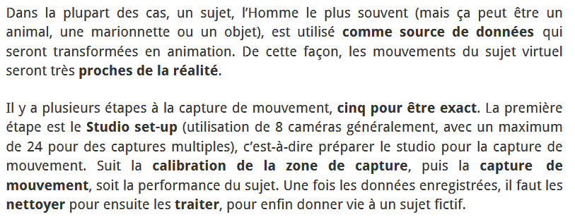](https://www.realite-virtuelle.com/tout-savoir-motion-capture/)

### Méthodes

[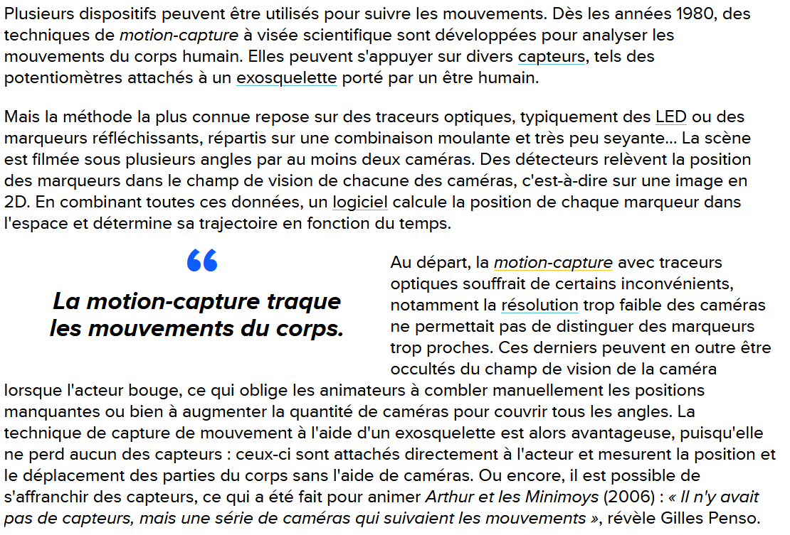](https://www.futura-sciences.com/tech/dossiers/technologie-cinema-animation-techniques-plus-grands-films-2537/page/5/)
[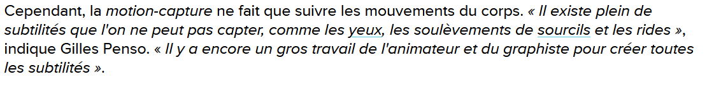](https://www.futura-sciences.com/tech/dossiers/technologie-cinema-animation-techniques-plus-grands-films-2537/page/5/)

### Etapes de réalisation

1. Studio set-up \
[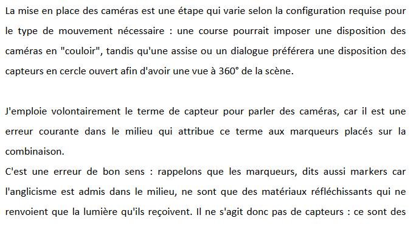](https://www.ati-paris8.fr/src/memoires/2014/Kacimi%20Iams-Miguel%20Oriana%20-%20Motion%20Capture%20et%20Rendu%20Expressif%20-%20Exp%C3%A9rimentations%20esth%C3%A9tiques%20et%20animation.pdf)
[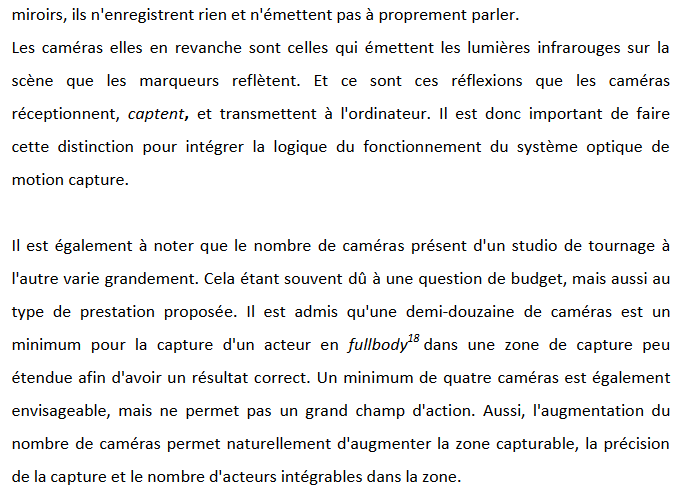](https://www.ati-paris8.fr/src/memoires/2014/Kacimi%20Iams-Miguel%20Oriana%20-%20Motion%20Capture%20et%20Rendu%20Expressif%20-%20Exp%C3%A9rimentations%20esth%C3%A9tiques%20et%20animation.pdf)
[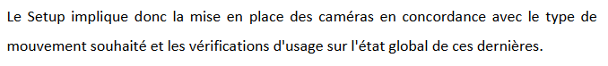](https://www.ati-paris8.fr/src/memoires/2014/Kacimi%20Iams-Miguel%20Oriana%20-%20Motion%20Capture%20et%20Rendu%20Expressif%20-%20Exp%C3%A9rimentations%20esth%C3%A9tiques%20et%20animation.pdf)

2. Calibration de la zone de capture \
[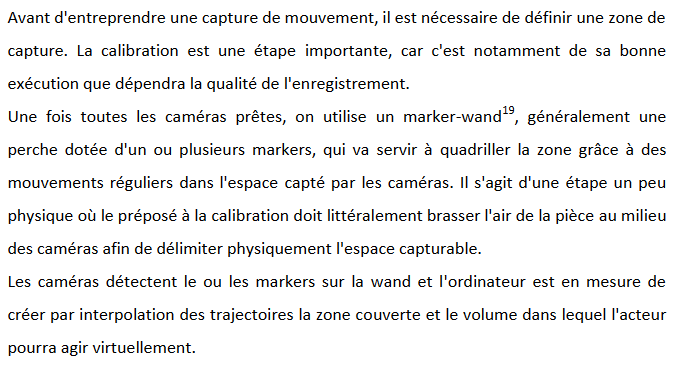](https://www.ati-paris8.fr/src/memoires/2014/Kacimi%20Iams-Miguel%20Oriana%20-%20Motion%20Capture%20et%20Rendu%20Expressif%20-%20Exp%C3%A9rimentations%20esth%C3%A9tiques%20et%20animation.pdf)

3. Mise en place des markers \
[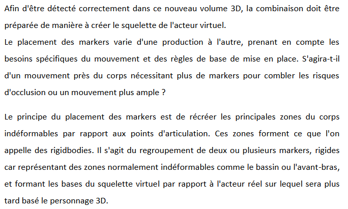](https://www.ati-paris8.fr/src/memoires/2014/Kacimi%20Iams-Miguel%20Oriana%20-%20Motion%20Capture%20et%20Rendu%20Expressif%20-%20Exp%C3%A9rimentations%20esth%C3%A9tiques%20et%20animation.pdf)

4. Capture, reconstruction de données et nettoyage \
[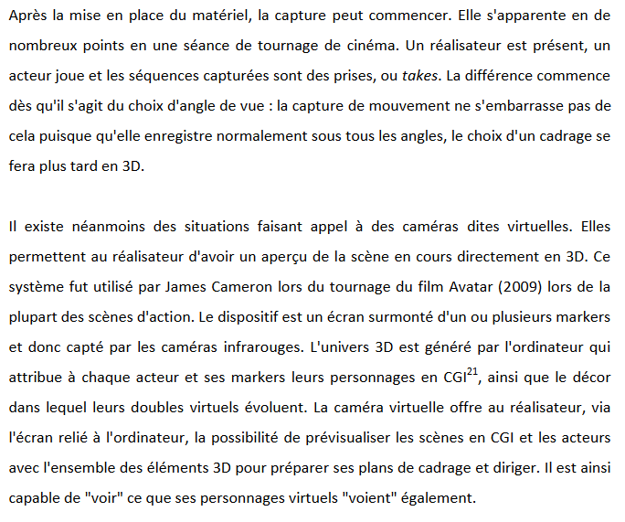](https://www.ati-paris8.fr/src/memoires/2014/Kacimi%20Iams-Miguel%20Oriana%20-%20Motion%20Capture%20et%20Rendu%20Expressif%20-%20Exp%C3%A9rimentations%20esth%C3%A9tiques%20et%20animation.pdf)
[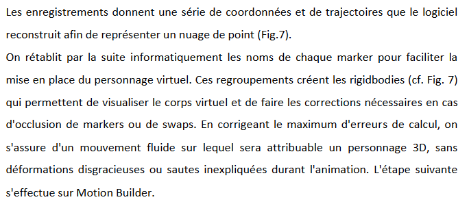](https://www.ati-paris8.fr/src/memoires/2014/Kacimi%20Iams-Miguel%20Oriana%20-%20Motion%20Capture%20et%20Rendu%20Expressif%20-%20Exp%C3%A9rimentations%20esth%C3%A9tiques%20et%20animation.pdf)

5. Mise en place 3D : De l'acteur réel au personnage virtuel \
[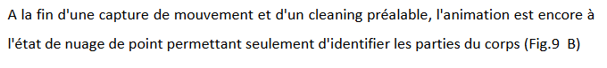](https://www.ati-paris8.fr/src/memoires/2014/Kacimi%20Iams-Miguel%20Oriana%20-%20Motion%20Capture%20et%20Rendu%20Expressif%20-%20Exp%C3%A9rimentations%20esth%C3%A9tiques%20et%20animation.pdf)
[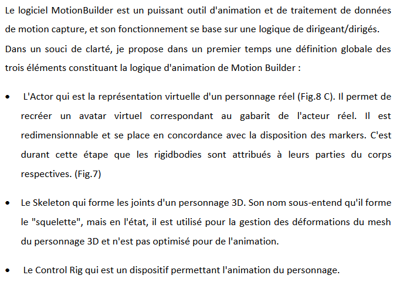](https://www.ati-paris8.fr/src/memoires/2014/Kacimi%20Iams-Miguel%20Oriana%20-%20Motion%20Capture%20et%20Rendu%20Expressif%20-%20Exp%C3%A9rimentations%20esth%C3%A9tiques%20et%20animation.pdf)
[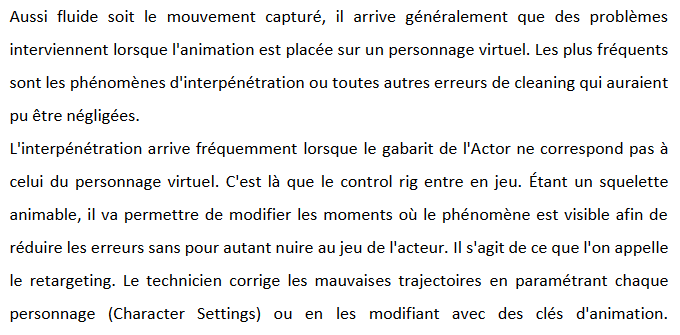](https://www.ati-paris8.fr/src/memoires/2014/Kacimi%20Iams-Miguel%20Oriana%20-%20Motion%20Capture%20et%20Rendu%20Expressif%20-%20Exp%C3%A9rimentations%20esth%C3%A9tiques%20et%20animation.pdf)

## Les différents types de *Motion Capture*

Il existe différents types de capture de mouvement. Elle peut être :
- **optique**
[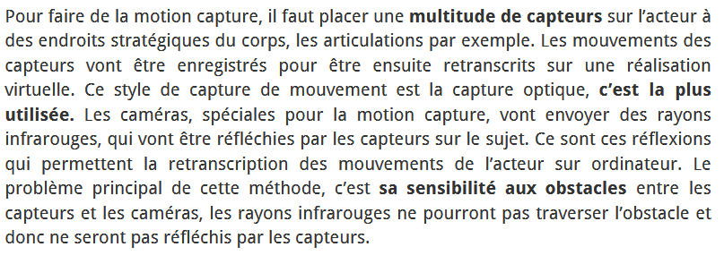](https://www.realite-virtuelle.com/tout-savoir-motion-capture/)

- **gyroscopique**
[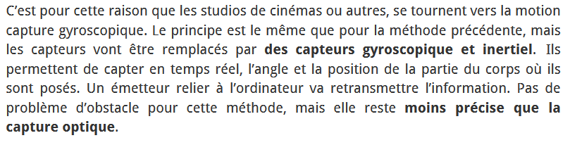](https://www.realite-virtuelle.com/tout-savoir-motion-capture/)

- **magnétique**
[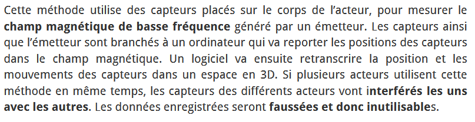](https://www.realite-virtuelle.com/tout-savoir-motion-capture/)

- **mécanique**
[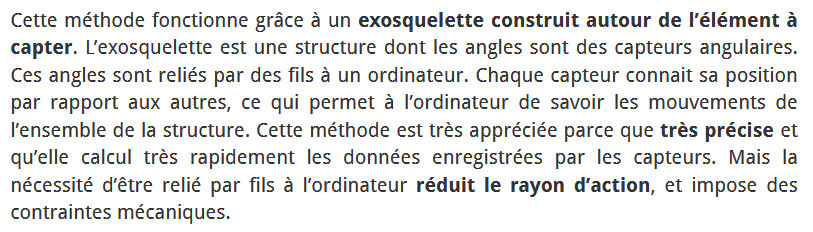](https://www.realite-virtuelle.com/tout-savoir-motion-capture/)
