# Historique

## Présentation générale
- CABANNES, Léo. Histoire de la Motion Capture. Dans : KDCB  - Motion Capture [en ligne]. 16 janvier 2013. [Consulté le 5 juin 2020]. Disponible à l’adresse : [https://kdcbtpe.wordpress.com/history/](https://kdcbtpe.wordpress.com/history/)

[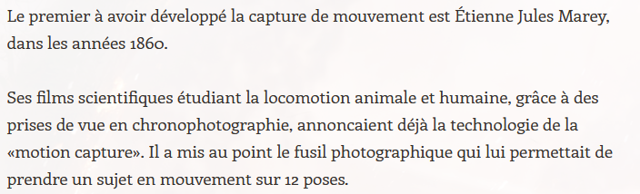](https://kdcbtpe.wordpress.com/history/)
[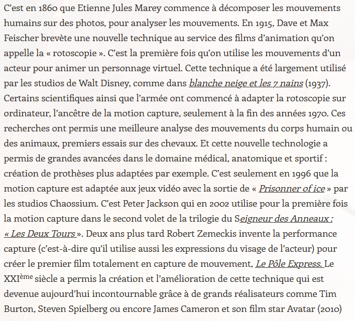](https://kdcbtpe.wordpress.com/history/)

## Quelques dates et évènements importants

- BOYER, Floriane. La motion-capture, capturer le mouvement. Dans : Futura [en ligne]. 16 octobre 2018. [Consulté le 7 juin 2020]. Disponible à l’adresse : [https://www.futura-sciences.com/tech/dossiers/technologie-cinema-animation-techniques-plus-grands-films-2537/page/5/](https://www.futura-sciences.com/tech/dossiers/technologie-cinema-animation-techniques-plus-grands-films-2537/page/5/)

[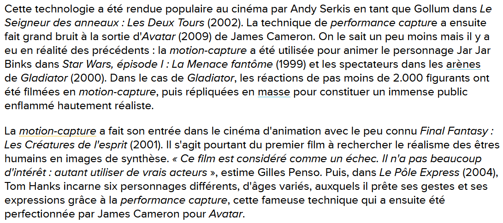](https://www.futura-sciences.com/tech/dossiers/technologie-cinema-animation-techniques-plus-grands-films-2537/page/5/)

## Evolution à travers le temps
### La chronophotographie

- [KACIMI IAMS-MIGUEL, Oriana. Motion Capture et Rendu Expressif. 2014 2013, p. 121](https://www.ati-paris8.fr/src/memoires/2014/Kacimi%20Iams-Miguel%20Oriana%20-%20Motion%20Capture%20et%20Rendu%20Expressif%20-%20Exp%C3%A9rimentations%20esth%C3%A9tiques%20et%20animation.pdf)

[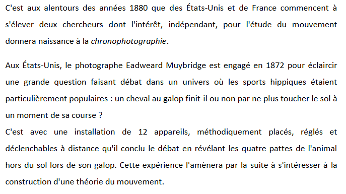](https://www.ati-paris8.fr/src/memoires/2014/Kacimi%20Iams-Miguel%20Oriana%20-%20Motion%20Capture%20et%20Rendu%20Expressif%20-%20Exp%C3%A9rimentations%20esth%C3%A9tiques%20et%20animation.pdf)
[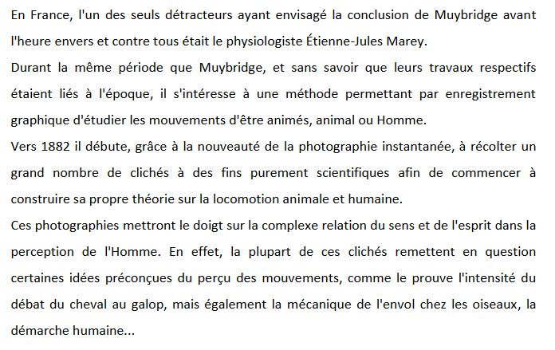](https://www.ati-paris8.fr/src/memoires/2014/Kacimi%20Iams-Miguel%20Oriana%20-%20Motion%20Capture%20et%20Rendu%20Expressif%20-%20Exp%C3%A9rimentations%20esth%C3%A9tiques%20et%20animation.pdf)
[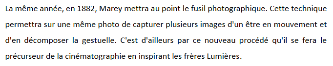](https://www.ati-paris8.fr/src/memoires/2014/Kacimi%20Iams-Miguel%20Oriana%20-%20Motion%20Capture%20et%20Rendu%20Expressif%20-%20Exp%C3%A9rimentations%20esth%C3%A9tiques%20et%20animation.pdf)

### La rotoscopie

- [Voir référence chronophotographie](https://www.ati-paris8.fr/src/memoires/2014/Kacimi%20Iams-Miguel%20Oriana%20-%20Motion%20Capture%20et%20Rendu%20Expressif%20-%20Exp%C3%A9rimentations%20esth%C3%A9tiques%20et%20animation.pdf)

[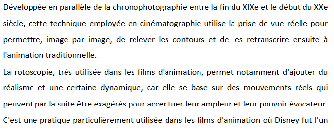](https://www.ati-paris8.fr/src/memoires/2014/Kacimi%20Iams-Miguel%20Oriana%20-%20Motion%20Capture%20et%20Rendu%20Expressif%20-%20Exp%C3%A9rimentations%20esth%C3%A9tiques%20et%20animation.pdf)
[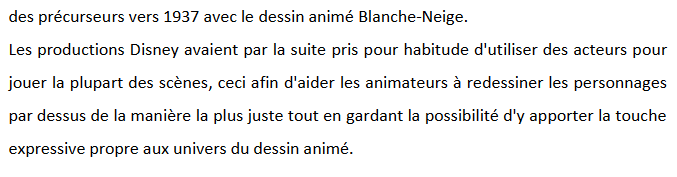](https://www.ati-paris8.fr/src/memoires/2014/Kacimi%20Iams-Miguel%20Oriana%20-%20Motion%20Capture%20et%20Rendu%20Expressif%20-%20Exp%C3%A9rimentations%20esth%C3%A9tiques%20et%20animation.pdf)
[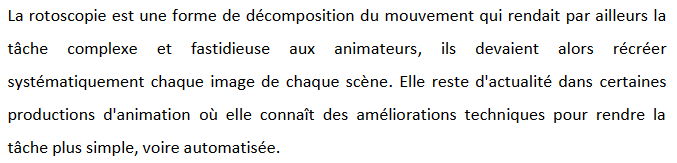](https://www.ati-paris8.fr/src/memoires/2014/Kacimi%20Iams-Miguel%20Oriana%20-%20Motion%20Capture%20et%20Rendu%20Expressif%20-%20Exp%C3%A9rimentations%20esth%C3%A9tiques%20et%20animation.pdf)

### La motion capture

- A. RENAUD. Tout savoir sur la motion capture, une technologie en plein boom ! Dans : Réalité-Virtuelle.com [en ligne]. 17 janvier 2016. [Consulté le 5 juin 2020]. Disponible à l’adresse : [https://www.realite-virtuelle.com/tout-savoir-motion-capture/](https://www.realite-virtuelle.com/tout-savoir-motion-capture/)

[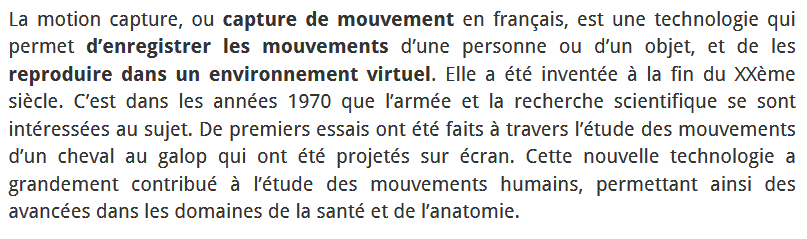](https://www.realite-virtuelle.com/tout-savoir-motion-capture/)
[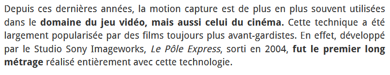](https://www.realite-virtuelle.com/tout-savoir-motion-capture/)

### La performance capture

- PAUME, Florian. Performance Capture : entre réalité et virtuel. Dans : Retour vers le Cinéma [en ligne]. 5 septembre 2015. [Consulté le 8 juin 2020]. Disponible à l’adresse : [https://www.retourverslecinema.com/performance-capture-entre-realite-et-virtuel/](https://www.retourverslecinema.com/performance-capture-entre-realite-et-virtuel/)

[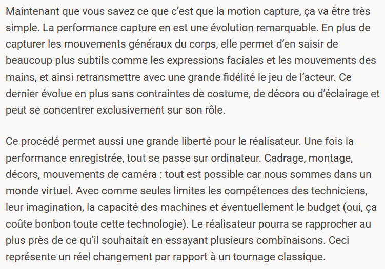](https://www.retourverslecinema.com/performance-capture-entre-realite-et-virtuel/)
