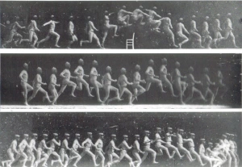
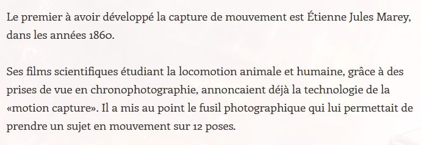
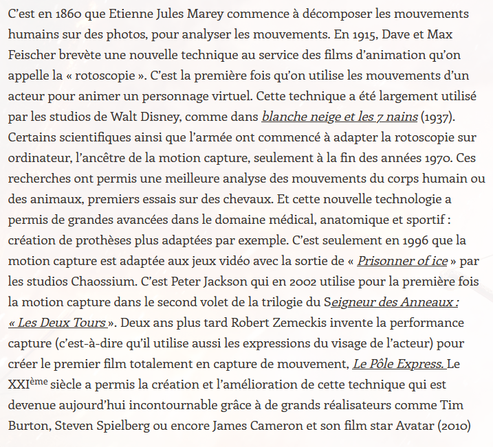
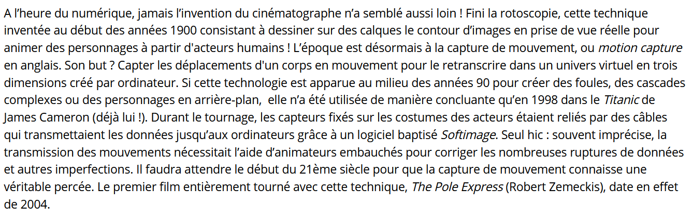
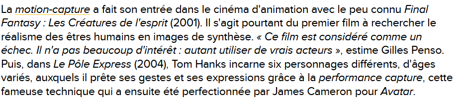
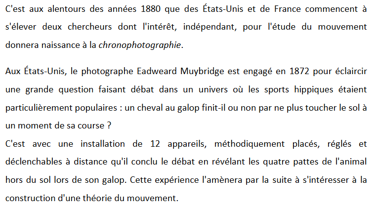

# Historique
- [CABANNES, Léo. Histoire de la Motion Capture. Dans : KDCB  - Motion Capture [en ligne]. 16 janvier 2013. [Consulté le 5 juin 2020]. Disponible à l’adresse : https://kdcbtpe.wordpress.com/history/](https://kdcbtpe.wordpress.com/history/)

- [KACIMI IAMS-MIGUEL, Oriana. Motion Capture et Rendu Expressif. 2014 2013, p. 121](https://www.ati-paris8.fr/src/memoires/2014/Kacimi%20Iams-Miguel%20Oriana%20-%20Motion%20Capture%20et%20Rendu%20Expressif%20-%20Exp%C3%A9rimentations%20esth%C3%A9tiques%20et%20animation.pdf)

## Présentation générale

## La chronophotographie

## La rotoscopie

## La motion capture

## La performance capture
