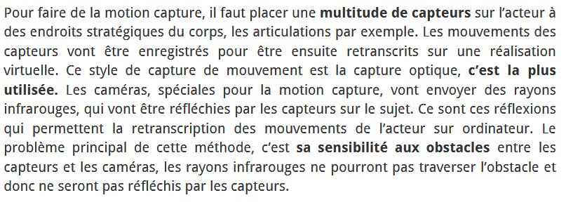
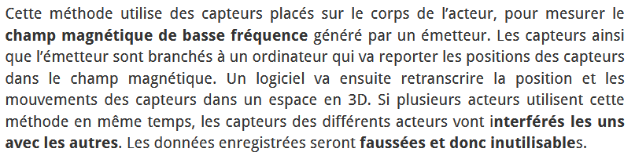

# Fonctionnement

[https://www.realite-virtuelle.com/tout-savoir-motion-capture/](https://www.realite-virtuelle.com/tout-savoir-motion-capture/)

## Comment fait-on la Motion Capture

## Les différents types de Motion Capture

[https://www.realite-virtuelle.com/tout-savoir-motion-capture/](https://www.realite-virtuelle.com/tout-savoir-motion-capture/)

Il existe différents types de capture de mouvement. Elle peut être :
- **optique**

- **gyroscopique**

- **magnétique**

- **mécanique**

